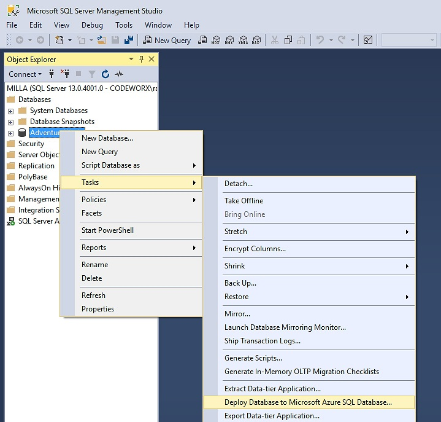

<!-- TOC -->

- [Demo Setup](#demo-setup)
    - [Database](#database)
        - [Export Wizard](#export-wizard)
        - [ConnectionString](#connectionstring)
    - [Deploy REST Service](#deploy-rest-service)
- [Data Access - direct <> service](#data-access---direct--service)
    - [direct access local or azure db](#direct-access-local-or-azure-db)
    - [service access azure db](#service-access-azure-db)
    - [reduce payload.](#reduce-payload)
    - [try different serializer/compression settings](#try-different-serializercompression-settings)
- [Streaming](#streaming)

<!-- /TOC -->

# Demo Setup

## Database

* Download a copy of the AdventureWorks DW Sample Database [here](https://www.microsoft.com/en-us/download/details.aspx?id=49502)
* Import the Database to your local SQL Server.
* Delete the **FactResellerSalesXL_CCI** and **FactResellerSalesXL_PageCompressed** table. Those Tables use features that are not supported on SQL Azure.
* Export the Database to SQL Azure

### Export Wizard



Deploy your local database to SQL Azure.

### ConnectionString
Update the connectionStrings in the [LargData.UI\app.config](https://github.com/schwarzr/Samples/tree/master/Azure/LargeData/LargData.UI/app.config) and the [LargData.Web\appsettings.json](https://github.com/schwarzr/Samples/tree/master/Azure/LargeData/LargData.Web/appsettings.json).

[LargData.UI\app.config](https://github.com/schwarzr/Samples/tree/master/Azure/LargeData/LargeData.UI/app.config)
```xml
<connectionStrings>
    <add name="AdventureWorksContext" connectionString="data source={localserver};initial catalog={localdb};integrated security=True;MultipleActiveResultSets=True;App=EntityFramework" providerName="System.Data.SqlClient" />
    <add name="AzureAdventureWorksContext" connectionString="Data Source={remoteserver};Initial Catalog={remotedb};Persist Security Info=False;User ID={remoteuser};Password={remotepassword};Pooling=False;MultipleActiveResultSets=False;Connect Timeout=60;Encrypt=False;TrustServerCertificate=True;" providerName="System.Data.SqlClient" />
</connectionStrings>
```
 [LargData.Web\appsettings.json](https://github.com/schwarzr/Samples/tree/master/Azure/LargeData/LargData.Web/appsettings.json)
```json
{
    "ConnectionStrings": {
        "AzureAdventureWorksContext": "Data Source={remoteserver};Initial Catalog={remotedb};Persist Security Info=False;User ID={remoteuser};Password={remotepassword};Pooling=False;MultipleActiveResultSets=False;Connect Timeout=60;Encrypt=False;TrustServerCertificate=True;"
    }
}
```
> replace `{localserver}`, `{localdb}` with your local SQL Server instance and database name

> replace `{remoteserver}`,`{remotedb}`, `{remoteuser}` and `{remotepassword}` with your SQL Server address and credentials

## Deploy REST Service
Publish the LargData.Web project as an Azure Web app.

Update the webservice url in the [LargData.UI/app.xaml.cs](LargData.UI/app.xaml.cs) file.
```csharp
protected virtual void OnConfigure(IServiceCollection service)
{
    var serviceUrl = "http://yourwebapp.azurewebsites.net";
    ...
}
```
# Data Access - direct <> service
## direct access local or azure db
[LargData.UI/app.xaml.cs](https://github.com/schwarzr/Samples/tree/master/Azure/LargeData/LargData.UI/app.xaml.cs)
```csharp
protected virtual void OnConfigure(IServiceCollection service)
{
    var serviceUrl = "http://yourwebapp.azurewebsites.net";

    service.AddScoped<AdventureWorksContext>();

    // Direct access
    // Local Database
    service.AddScoped<AdventureWorksContext>(p => new AdventureWorksContext("name=AdventureWorksContext"));
    // Azure Database
    //service.AddScoped<AdventureWorksContext>(o => new AdventureWorksContext("name=AzureAdventureWorksContext"));
    service.AddScoped<IInternetSalesService, InternetSalesService>();

    // REST Service access
    // ...

    service.AddTransient<LargeDataViewModel>();
}
```
Start the LargeData.UI app with local and the azure db configuration and compare the request times.

Switch to service communication.

## service access azure db
[LargData.UI/app.xaml.cs](https://github.com/schwarzr/Samples/tree/master/Azure/LargeData/LargData.UI/app.xaml.cs)
```csharp
protected virtual void OnConfigure(IServiceCollection service)
{
    var serviceUrl = "http://yourwebapp.azurewebsites.net";

    //service.AddScoped<AdventureWorksContext>();

    // Direct access
    // Local Database
    //service.AddScoped<AdventureWorksContext>(p => new AdventureWorksContext("name=AdventureWorksContext"));
    // Azure Database
    //service.AddScoped<AdventureWorksContext>(o => new AdventureWorksContext("name=AzureAdventureWorksContext"));
    //service.AddScoped<IInternetSalesService, InternetSalesService>();

    // REST Service access
    // XML serializer
    service.AddScoped<IInternetSalesService>(p => new RemoteInternetSalesService(serviceUrl, SerializationStrategy.Xml, false));

    // JSON serializer
    //service.AddScoped<IInternetSalesService>(p => new RemoteInternetSalesService(serviceUrl, SerializationStrategy.Json, false));

    // ProtoBuf serializer
    //service.AddScoped<IInternetSalesService>(p => new RemoteInternetSalesService(serviceUrl, SerializationStrategy.ProtoBuf, false));

    // ProtopBuf + content compression
    //service.AddScoped<IInternetSalesService>(p => new RemoteInternetSalesService(serviceUrl, SerializationStrategy.ProtoBuf, true));
    service.AddTransient<LargeDataViewModel>();
}
```

## reduce payload.
Step 2

[LargData.UI/ViewModel/LargeDataViewModel.cs](https://github.com/schwarzr/Samples/tree/master/Azure/LargeData/LargData.UI/ViewModel/LargeDataViewModel.cs)
```csharp
protected async Task LoadDataAsync()
{
    using (StartJob("loading..."))
    {
        // Step 1 - eager loaded entity objects
        //var items = await Service.GetInternetSalesAsync(this.From, this.Until);
        //this.Items = new ObservableCollection<InternetSale>(items);

        // Step 2 - mapped object from service
        var items = await Service.GetInternetSaleInfosAsync(this.From, this.Until);
        this.Items = new ObservableCollection<InternetSaleInfo>(items);

        // Step 3 - Streamed requests
        //this.Items = new ObservableCollection<InternetSaleInfo>();
        //var stream = await Service.GetInternetSaleInfoStreamAsync(this.From, this.Until);
        //var dr = new DataStreamReader<InternetSaleInfo>(stream);
        //var processor = new ChunkLoad<InternetSaleInfo>(this.Items, 1000);
        //await dr.ReadDataAsync(processor);
        //processor.Complete();
    }
}
```

[LargData.UI/View/LargeDataView.xaml](https://github.com/schwarzr/Samples/tree/master/Azure/LargeData/LargData.UI/View/LargeDataView.xaml)
```xml
<!--Step 1-->
<!--<DataGrid Grid.Row="1" AutoGenerateColumns="False" ItemsSource="{Binding Path=Items}" Name="grid">
    ...
</DataGrid>-->

<!--Step 2 + 3-->
<DataGrid Grid.Row="1" AutoGenerateColumns="False" ItemsSource="{Binding Path=Items}" Name="grid">
    ...
</DataGrid>
```

## try different serializer/compression settings

[LargData.UI/app.xaml.cs](https://github.com/schwarzr/Samples/tree/master/Azure/LargeData/LargData.UI/app.xaml.cs)
```csharp
protected virtual void OnConfigure(IServiceCollection service)
{
    var serviceUrl = "http://yourwebapp.azurewebsites.net";

    //service.AddScoped<AdventureWorksContext>();

    // Direct access
    // ...
    
    // REST Service access
    // XML serializer
    //service.AddScoped<IInternetSalesService>(p => new RemoteInternetSalesService//(serviceUrl, SerializationStrategy.Xml, false));

    // JSON serializer
    //service.AddScoped<IInternetSalesService>(p => new RemoteInternetSalesService(serviceUrl, SerializationStrategy.Json, false));

    // ProtoBuf serializer
    service.AddScoped<IInternetSalesService>(p => new RemoteInternetSalesService(serviceUrl, SerializationStrategy.ProtoBuf, false));

    // ProtopBuf + content compression
    //service.AddScoped<IInternetSalesService>(p => new RemoteInternetSalesService(serviceUrl, SerializationStrategy.ProtoBuf, true));
    service.AddTransient<LargeDataViewModel>();
}
```
Depending on your latency and bandwidth you should see a huge difference compared to the direct SQL access.

# Streaming
Step 3

[LargData.UI/ViewModel/LargeDataViewModel.cs](https://github.com/schwarzr/Samples/tree/master/Azure/LargeData/LargData.UI/ViewModel/LargeDataViewModel.cs)
```csharp
protected async Task LoadDataAsync()
{
    using (StartJob("loading..."))
    {
        // Step 1 - eager loaded entity objects
        //var items = await Service.GetInternetSalesAsync(this.From, this.Until);
        //this.Items = new ObservableCollection<InternetSale>(items);

        // Step 2 - mapped object from service
        //var items = await Service.GetInternetSaleInfosAsync(this.From, this.Until);
        //this.Items = new ObservableCollection<InternetSaleInfo>(items);

        // Step 3 - Streamed requests
        this.Items = new ObservableCollection<InternetSaleInfo>();
        var stream = await Service.GetInternetSaleInfoStreamAsync(this.From, this.Until);
        var dr = new DataStreamReader<InternetSaleInfo>(stream);
        var processor = new ChunkLoad<InternetSaleInfo>(this.Items, 1000);
        await dr.ReadDataAsync(processor);
        processor.Complete();
    }
}
```