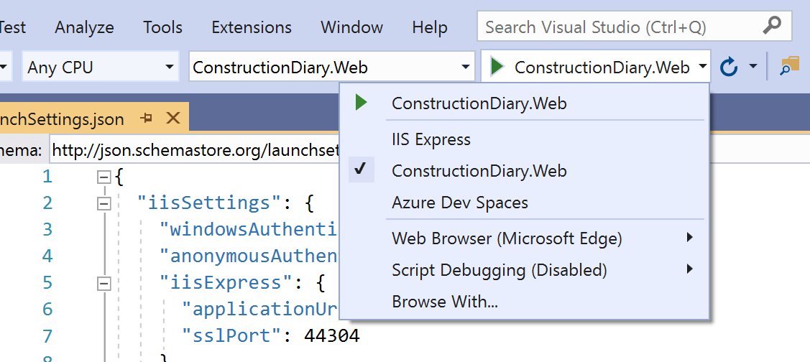

# Architecture for online Web and On-/Offline Xamarin App Frontend 

This sample contains a contract based reference architecture for modern dotnet core  /Angular / Xamarin applications with online and offline capabilities.

The applications base architecure is built on top of the dotnet core dependency inject api and the following base components:

## online :
* EntityFramework Core -> MSSQL Server 
* Asp.NET Core Api Services
* Angular 7 Frontend
* Xamarin.Forms app in online mode

## offline:
* EntityFramework Core -> Sqlite
* Directly injected service implementations
* Xamarin.Forms app in offline mode
* Custom made sync framework based on MsSQL ChangeTracking and a custom sqlite column level change tracker.

# Requirements
* Visual Studio 2017 or later
* latest Xamarin.Forms
* latest node.js version
* (optional) Visual Studio Code

# Setup

## Xamarin app and Backend

Launch ConstructionDiary.sln in Visual Studio 2017 or later.

Update the Sql Server ConnectionString for DiaryContext in [appsettings.json](ConstructionDiary.Web\appsettings.json) to your preferred sql instance.

If you start the application in Development mode and the connection string points to a none existing database, the db, tables and sample data will be crated automatically.

If you want to connect the locally running xamarin app to the locally running backend you need to expose the web app on the external ip address, because android devices or the emulator can not resolve localhost. In order to do so, just switch from iisexpress to kestrel hosting.



Select multiple startup Projects

* ConstructionDiary.Web

And
* ConstructionDiary.App.Android or
* ConstructionDiary.App.UWP 


## Angular Web Frontend

Go to the Web project folder and run npm install.
```dos
C:\Samples\Xamarin.Offline\ConstructionDiary.Web>npm install
```

You have two options to compile and run the angular frontend.

### Command line

```dos
C:\Samples\Xamarin.Offline\ConstructionDiary.Web>npm run build -- --watch
```

After the Anguar cli compiler completed, start your browser and navigate to http://localhost:5001/

### or Visual Studio Code

There is a launch.config for Visual Studio Code that starts the angular cli compile and launches the chrome browser with your vs code debugger attached to the chrome instance. The chrome debugger extension needs to be installed for this config to work.

If the extension is installed you should be able to simply press F5 in VS Code and your chrome browser should be started after the Angular compilation finished. The backend project must be running at this point